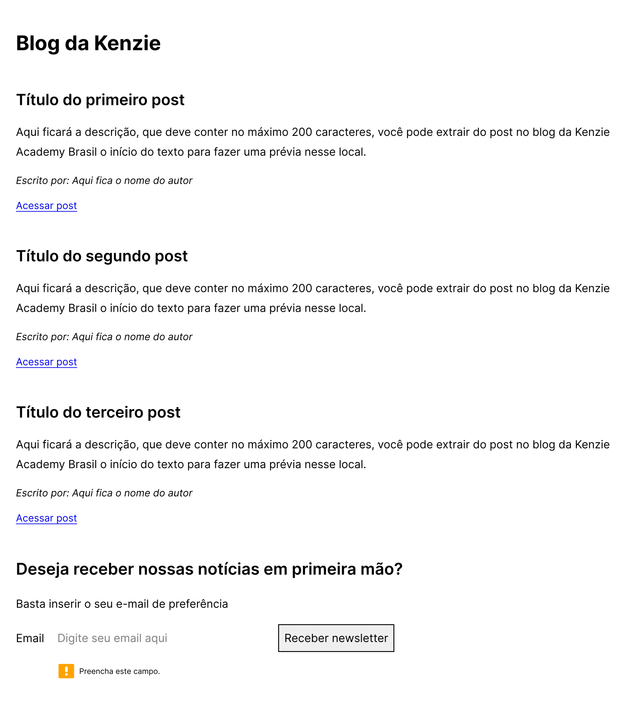
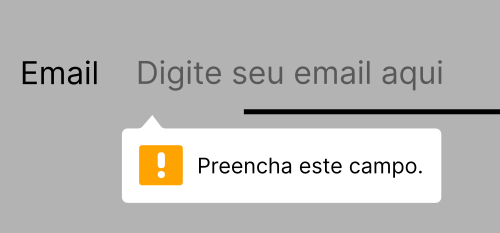

<h1>Entrega: Blog Kenzie HTML</h1>

<h3>Introdução</h3>
Nessa entrega vamos criar estrutura de um blog com HTML e utilizar o blog da Kenzie como referência para criar os posts.

<h3>Ideia geral</h3>
Esse site será um compilado de artigos com links para endereços externos. Ao clicar no post, o usuário será levado para outro site e visualizará o artigo completo.

Após os posts, teremos um formulário solicitando o email do usuário. Chamaremos este formulário de Newsletter.

<h3>Orientações</h3>
<h4>Posts</h4>
Escolha quatro postagens do blog da Kenzie e crie os posts no seu HTML sendo:

- Título: Título do post extraído no blog da Kenzie
- Descrição: Máximo de 200 caracteres.
- Autor: Autor do post extraído no blog da Kenzie
- Link: Contendo a URL do post no site da Kenzie

<h4>Newsletter</h4>
Após os posts, você precisará criar uma seção que solicita a assinatura do usuário para a newsletter do seu blog, contendo:

- Título: Deseja receber nossas notícias em primeira mão?
- Descrição: Breve explicação do que é necessário para receber as notícias
- Campo de email: Obrigatório, lembre-se de usar a propriedade adequada para este input
- Botão para assinar a newsletter: Botão para enviar o formulário
- Para dar uma referência visual de como deverão ser disponibilizados os conteúdos, segue um exemplo: 
 

<h3>O que será avaliado?</h3>

- Configurações utilizando metatags
- Utilização de tags semânticas do HTML.
- Input do formulário da Newsletter com atributos adequados. Segue um exemplo: 
 

 
 

<b>Taken from Kenzie Academy Brasil</b>

