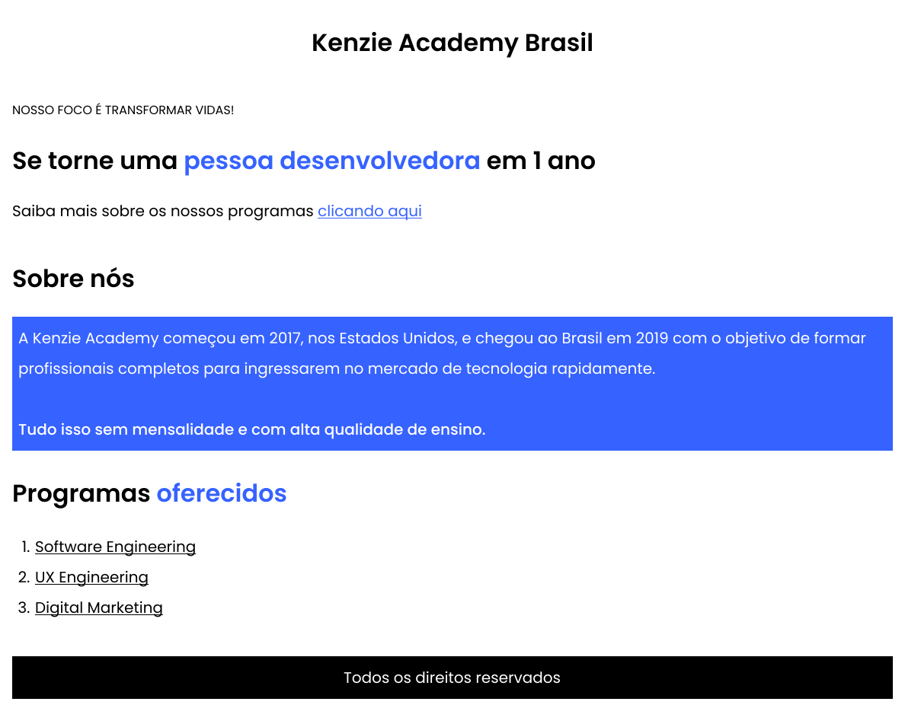

<h1>Atividade CSS - Utilizando os Seletores CSS</h1>

<h3>Visão Geral</h3>
Nos conteúdos anteriores você aprendeu a utilizar alguns seletores. Hora de praticar!

Como deve ficar o seu site:

<h3>Passo a Passo:</h3>

- Crie um arquivo HTML e um CSS para executar as tarefas.
- Para o título 'Kenzie Academy Brasil': Crie uma tag h1.
- Para o texto 'NOSSO FOCO É TRANSFORMAR VIDAS!': Crie uma tag small e insira o segundo texto.
- Para o texto 'Se torne uma pessoa desenvolvedora em 1 ano': Crie uma tag h2. Dentro do título, envolva o texto 'pessoa desenvolvedora' com uma tag span, e nesta tag insira a classe 'color-blue' para inserir a cor azul no trecho. Você deve estilizar essa classe para que ela ganhe o estilo necessário.
- Para o texto 'Saiba mais sobre os nossos programas clicando aqui': Crie uma tag P para inserir o texto, e ao final insira uma tag a para inserir o link, envolvendo o texto: 'clicando aqui'.
- Para o título 'Sobre nós': Crie uma tag h2.
- Para o texto 'A Kenzie Academy começou em 2017, nos Estados Unidos, e chegou ao Brasil em 2019...': Crie uma tag p e insira a class 'background-blue' e realize a estilização onde o background é azul e o texto é branco.
- Para o texto 'Programas oferecidos': Crie uma tag h2. Dentro do título, envolva o texto 'oferecidos' com uma tag span, e nesta tag insira a classe 'color-blue' para inserir a cor azul no trecho.
- No texto com a lista 'Software Engineering - UX Engineering...': Crie uma tag ul e envolva cada item da lista dentro de uma tag li.
- Para o texto 'Todos os direitos reservados': Crie uma tag p com a classe 'background-black', onde o background é preto e a cor do texto é branca.
- Para os textos centralizados: crie uma classe com o nome 'text-center' e insira a propriedade text-align: center.
 
 

<b>Taken from Kenzie Academy Brasil</b>

