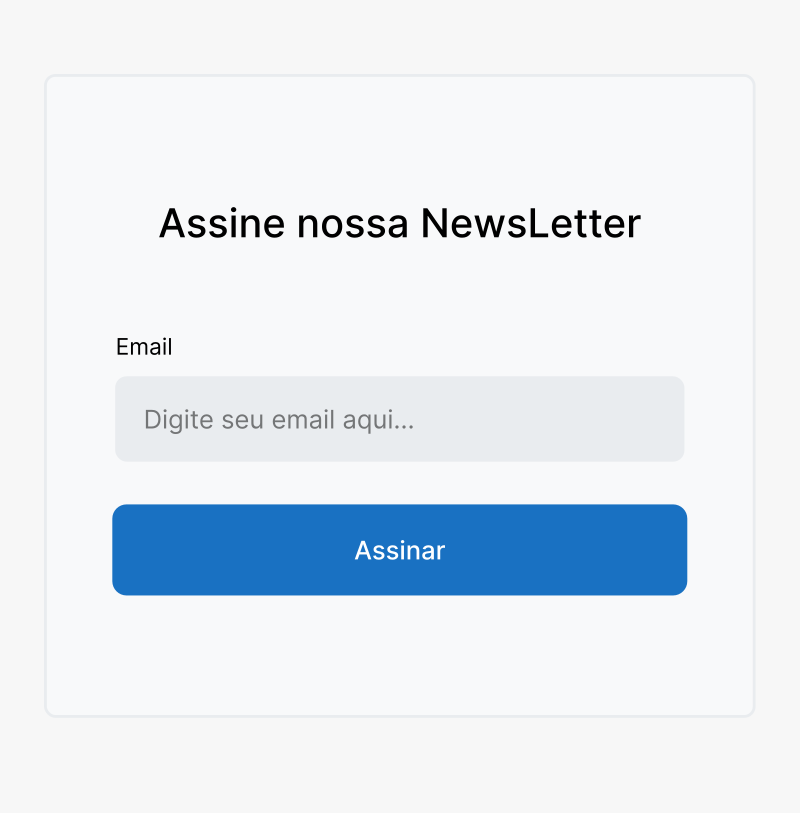

<h1>Atividade - Criando seção interativa</h1>

Nas últimas aulas você aprendeu usar diversas propriedades, agora chegou a hora de treinar.

<h3>Proposta</h3>
Você foi convidado a participar de um projeto. Seu principal objetivo é reproduzir o layout de um card, que será inserido na página do blog do cliente.

O layout é bem simples e você acredita que vai conseguir criar sem problemas usando a pseudo-classe hover para os efeitos e as propriedades de margin, padding e border para alinhar os elementos.

O contratante ficou sabendo que você é muito bom com tags semânticas e ele acredita que o card ficaria melhor se utilizasse este conceito, pois leu em algum lugar que melhora o desempenho do site e a acessibilidade para leitores de tela.

Layout:

No exemplo acima você pode ter uma noção estática do que está acontecendo. <a href="https://www.figma.com/proto/Hwj4rsJL8guNuxkaEHU8Ki/Untitled?node-id=10%3A2&scaling=scale-down-width&page-id=0%3A1&starting-point-node-id=10%3A2&hotspot-hints=0&hide-ui=1">Neste link</a> você consegue reproduzir o exemplo de maneira dinâmica, observando os estados de ações como hover e focus As cores utilizadas são estas:

<h4>Guia do Botão</h4>

- Botão padrão: #1971C2;
- Botão hover: #1864AB;

<h4>Atenção</h4>
Quando o botão sofre a ação de click (focus) ele recebe uma borda com a cor #000000;

<h4>Guia do Input</h4>

- Input padrão: #E9ECEF;
- Input hover: #DEE2E6;

<h4>Atenção</h4>
Quando o input sofre a ação de click (focus) ele recebe uma borda com a cor #000000, e um background de cor #FFFFFF.
 
 

<b>Taken from Kenzie Academy Brasil</b>

