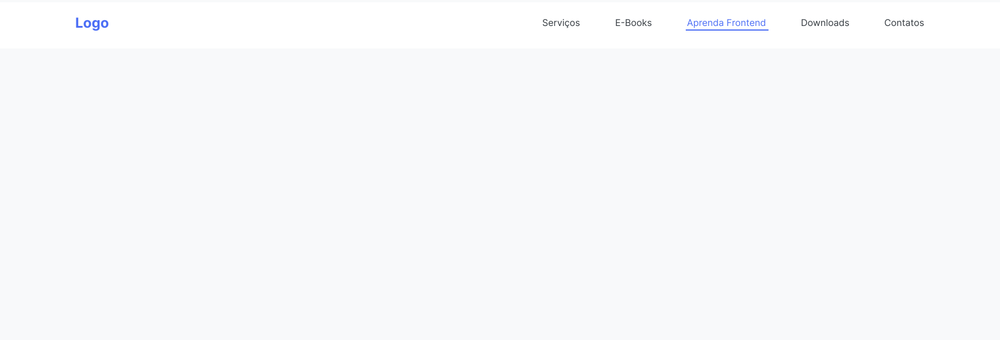

<h1>Utilizando Flexbox no meu Menu</h1>

Nessa atividade vamos praticar um pouco mais sobre os conceitos de Flexbox.

Exemplo de como deve ficar:

Você pode acessar o layout de forma mais clara acessando o link do aplicativo <a href="https://www.figma.com/file/RokUwXAga4UKM3KWTnD182/M1---S2-04-%7C-%F0%9F%92%AA-Atividade---CSS---Utilizando-Flexbox-no-meu-Menu?node-id=0%3A1&t=IsPQMOxr8E6IbWkz-0">Figma</a>

<h3>Exercício</h3>

- Centralizar o contêiner.
- Aplicar o display como flex.
- Alinhar tudo ao centro da coluna.
- Criar uma quebra de items com o flex-wrap (caso o dispositivo diminua de tela os itens automaticamente deve ficar um embaixo do outro).
- Deixar ocupando 100% de largura.
- Remova os estilos padrão dos links das listas.
- Definir cor #343A40 nos elementos de link.
- Mudar a cor do elemento h1 'Logo' para '#4C6EF5'
- Para este h1, defina um font-size de 24 pixels
- Adicionar efeito hover nos links, trocando a cor para '#4C6EF5'.
- Font-Family utilizada: 'Inter Sans Serif'.
 
 

<b>Taken from Kenzie Academy Brasil</b>

