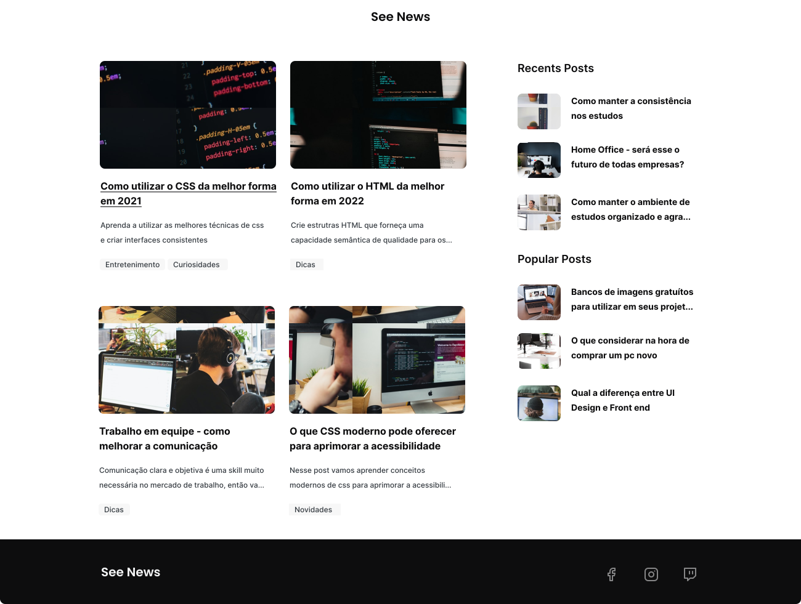
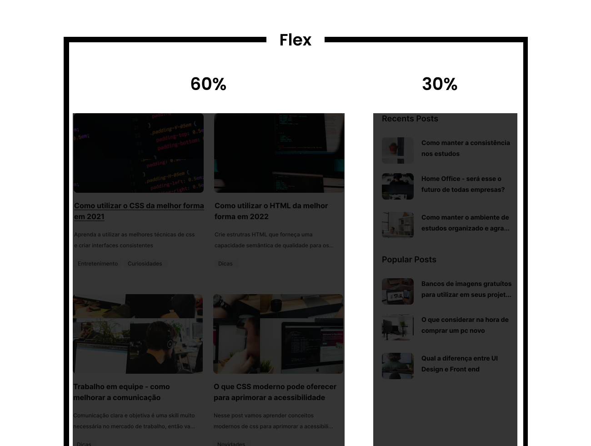

<h1>CSS: Página Blog - Flexbox</h1>

Nessa atividade vamos exercitar nosso conhecimento em CSS utilizando o Flexbox.

Temos uma interface de um blog, onde teremos os posts e algumas categorias como: Todos os posts, Últimos posts e os Mais populares

Consegue observar que temos duas colunas?

<h3>Vamos para a prática:</h3>

- Utilize o conceito de Flexbox para posicionar cada post.
- Defina 1300px de largura máxima para o container da aplicação.
- Utilize os efeitos de hover para os cards dos posts, como indicado no style guide (Guia de estilos) no <a href="https://www.figma.com/file/TfmTpNyDv7RV6ODHkRhZit/%F0%9F%92%AA-Atividade--CSS%3A-P%C3%A1gina-Blog---Flexbox?t=L74TOPDSj3s0dENf-0">Figma</a>.
 
 

<b>Taken from Kenzie Academy Brasil</b>

