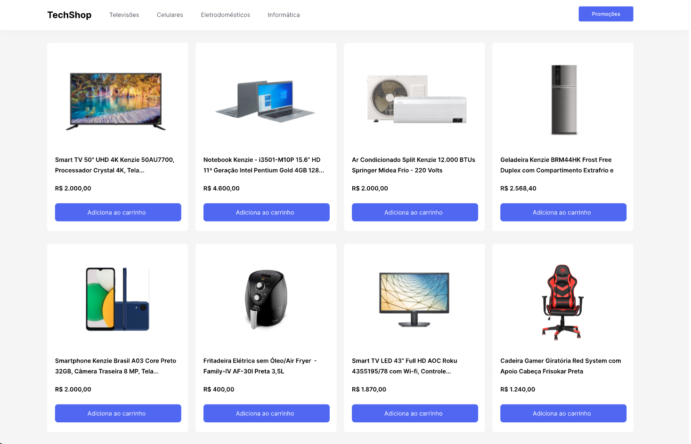
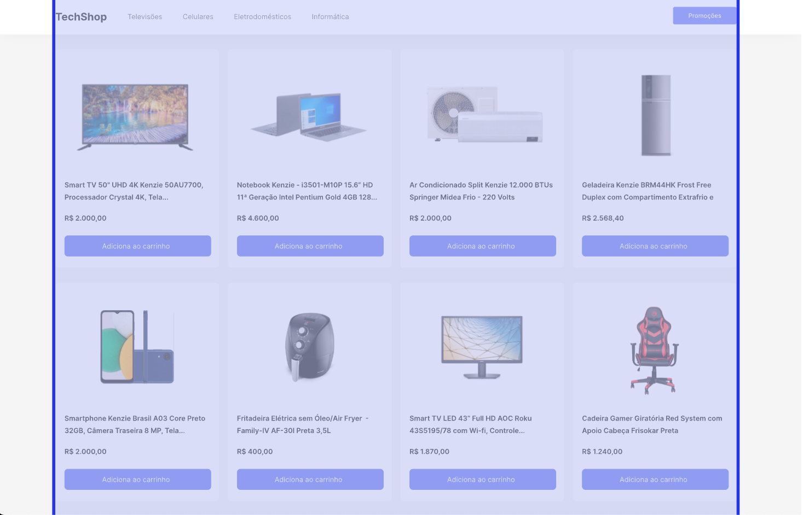
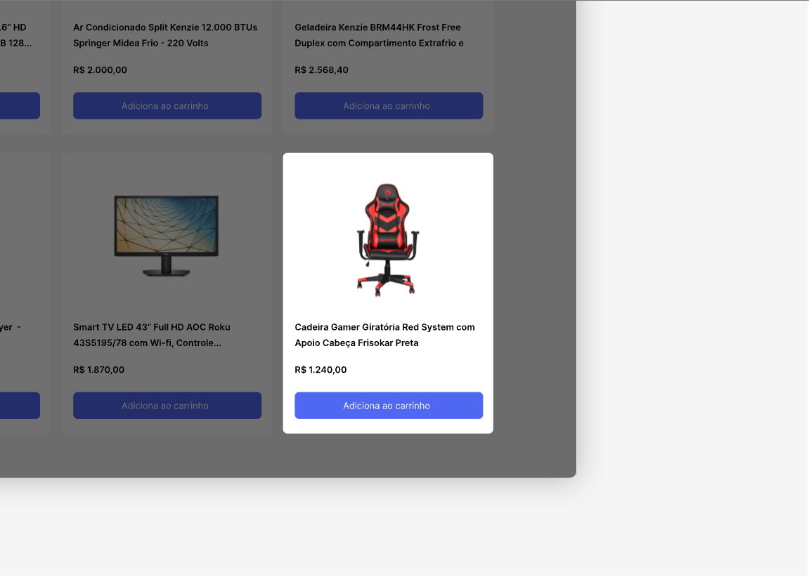

Desafio - CSS: E-commerce com FlexBox

Introdução
Neste desafio aplicaremos os conceitos vistos sobre flexbox.

Primeiro criaremos um menu e depois uma lista de produtos, tudo isso utilizando Flexbox.

O resultado deve ser o seguinte:

Vamos para prática:
Todos os códigos demonstrados aqui são sugestões, você poderá adaptar da melhor forma.

Antes de iniciar a atividade você deverá criar a estrutura inicial (HTML) de sua página.

Definindo limite do conteúdo
Para iniciar, no arquivo CSS, criaremos uma classe principal para limitar a largura máxima do conteúdo e deixar centralizado, por exemplo:

<!-- .container{
max-width: 1200px;
margin: 0 auto; /_ Centralizando o conteúdo_/
} -->

Essa configuração inicial irá fazer referência ao limite do conteúdo, como visto na imagem abaixo:

Criando Menu
Iniciaremos criando nossa estrutura HTML

<!-- <header class="menu">
    

        

            

                <h1 class="logo">TechShop</h1>
                <nav class="menu-nav">
                    <ul>
                        <li><a href="">Televisões</a></li>
                        <li><a href="">Celulares</a></li>
                        <li><a href="">Eletrodomésticos</a></li>
                        <li><a href="">Informática</a></li>
                    </ul>
                </nav>
            

            
<a href="" class="menu-link-button">Promoções</a>

        

    

</header> -->

Agora vamos para o css do menu

<!-- .menu {
width: 100%;
background: #ffffff;
box-shadow: 0px 4px 30px -10px rgba(0, 0, 0, 0.1);
}

.menu-flex {
display: flex;
align-items: center;
}

.menu-column {
display: flex;
align-items: center;
width: 50%;
justify-content: flex-start;
}

.menu-column.menu-second-column {
justify-content: flex-end;
}

.menu-nav ul {
display: flex;
list-style: none;
gap: 10px; /_ Vamos utilizar essa propriedade do flex para colocar um espaçamento entre os elementos_/
}

.menu-nav ul li a {
text-decoration: none;
color: #585e65;
}

.menu-link-button {
text-decoration: none;
height: 48px;
background-color: #4c6ef5;
color: #fff;
padding: 0 32px;
display: flex;
align-items: center;
border-radius: 4px;
} -->

Ótimo temos o nosso menu completo

Mas não paramos por aqui, estilizaremos nossos produtos.

Agora temos um desafio bônus.

Você irá estruturar e estilizar o card do produto por conta própria, como visto na imagem abaixo:

Para que os cards fiquem dispostos em 4 itens por linha, como no layout, você poderá definir uma largura relativa de 24%.

Assim que você terminar a estilização do card, iremos para o próximo passo, onde faremos juntos.

Deixando os cards com posicionamento flexível
Crie uma tag Main com a classe 'products-wrapper'
Essa tag deverá cobrir todos os cards de produtos, por exemplo:

<!-- <main class="products-wrapper"></main> -->

Mas, para que essa área fique no limite do nosso site, cobriremos essa tag com nossa div 'container'

<!-- 
<main class="products-wrapper"></main>
 -->

Pronto, agora estilizaremos
Vamos acessar nossa classe 'products-wrapper' e estilizar

<!-- .products-wrapper{
display: flex;
justify-content: space-between;
flex-wrap: wrap;
} -->

Pronto, temos agora uma aplicação bem interessante, utilizando o flexbox. Deixe todos conferirem o quanto você é bom com o css. Publique no LinkedIn e compartilhe o link do GithubPages com a família e amigos.
