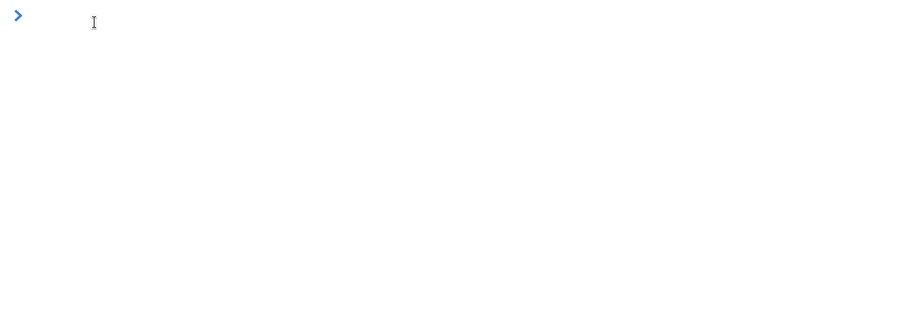

Entrega - Javascript: SnapCrackle

Introdução
Nesta entrega você utilizará os conhecimentos que aprendeu até o momento sobre arrays, loops, condicionais e strings.

Você deverá criar os arquivos index.html e snapCrackle.js e seguir o passo a passo abaixo.

Passo a Passo
Esta função deve realizar um loop que inicia em 1 e vai até maxValue para montar uma string seguindo uma sequência de condições.

Escreva uma função snapCrackle que recebe um parâmetro maxValue.
Condições:
Se o número for ímpar, no lugar dele, concatenar "Snap" no final da string.
Se o número for múltiplo de 5, no lugar dele, concatenar "Crackle" no final da string.
Se o número for ímpar e múltiplo de 5, no lugar dele, concatenar "SnapCrackle" no final da string.
Se o número não for nem ímpar e nem múltiplo de 5, concatenar o próprio número no final da string.
Seus itens devem ser separados sempre por vírgula e espaço.
Esta função deve retornar a string obtida

Exemplo

