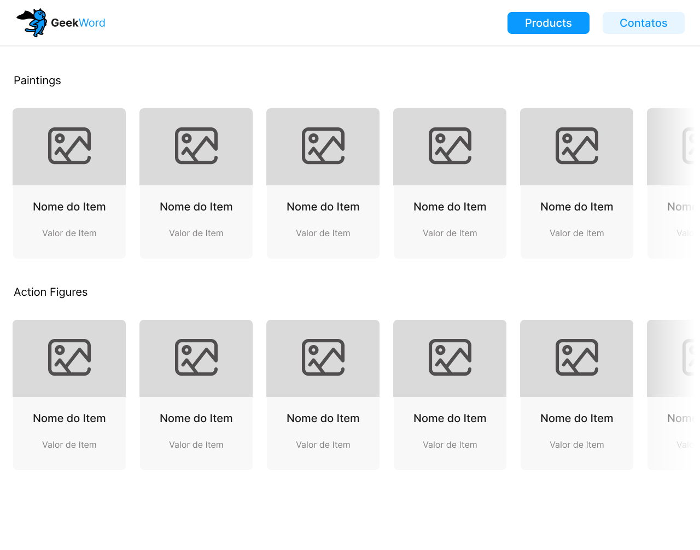

<h1>JavaScript | Entrega - Catálogo Geek</h1>

<h3>Introdução</h3>
Você foi convidado para ajudar alguns desenvolvedores a criar uma página Geek.

Iniciamente vocês usarão a página para listar os produtos que eles possuem em estoque e efetuarão as vendas por telefone ou aplicativos de venda.

Em suma, um catálogo virtual.

Os exemplos de código servem para demonstrar a lógica da construção. O desenvolvimento é totalmente seu.

A equipe fornecerá todas as imagens para a construção do catálogo.

<h4>Crie a estrutura do projeto:</h4>

- Crie os arquivos index.html, style.css e script.js.
- Desenvolva dentro do arquivo index.html a estrutura HTML base.
- Ligue ao index.html a folha de estilo e o script.

Já existe um layout a ser implementado:

Pensando na marcação
Antes de começar a criar os estilos, você deve pensar em como sua página será marcada. Pense no seu HTML como "caixas". Então vamos analisar.

- Nós temos o corpo do nosso documento.
- Dentro do corpo, temos nosso menu de navegação e também o nosso conteúdo principal.
- Dentro do nosso conteúdo principal vamos ter duas seções.
- Cada seção carrega uma lista.
- Depois que sua marcação foi pensada, chegou o momento de criar.

Dentro do seu index.html crie os elementos necessários para que você consiga chegar à marcação sugerida.

Lembre-se que você trabalhará com CSS, então ganhe tempo criando suas tags e dando-lhes suas respectivas classes.

Dar classes às tags é muito importante, pois a partir delas é que vai conseguir capturar os elementos necessários para manipulação no CSS e no JavaScript.

<h4>Com estilo</h4>
Identidade visual é tudo! Alguns critérios devem ser respeitados.

<h4>As cores</h4>

<b>Cor Hexadecimal Local</b>

Azul #0A99FE Menu ativo (clicado)

Azul c/ Opacidade #0A99FE com 10% de opacidade Menu inativo

Preto #1B1B1B Títulos

Cinza #868383 Textos

Branco #FFFFFF Fundo da Barra de navegação e da página

<h4>Os tamanhos</h4>

<b>Elemento Largura Altura</b>

Card 207px 275px

Botões 150px 40px

<h4>Imagem</h4>
Deverá ocupar a parte superior do card, podem ser alteradas da maneira que for melhor para ficarem adequadas ao espaço.

font-family Roboto, sans-serif

<b>Local Tamanho Tipo</b>

Título do Card 20px Medium

Valor do Produto 16px Regular

Títulos de seção 20px Regular

Texto dos botões 20px Regular

<h4>Fonte do texto</h4>
@import url('https://fonts.googleapis.com/css2?family=Roboto&display=swap');

A equipe já separou a fonte do projeto. Basta inserir a importação acima na folha de estilo.

Pense no layout de forma que seja usual. Caso a quantidade de itens aumente, não é interessante que a página quebre.

Você pode usar uma barra de rolagem horizontal para solucionar este problema. Para isso, dentro de cada seção use o atributo:

overflow-x: auto;

Este comando fará com que a barra de rolagem do eixo x (Horizontal) apareça sempre que a largura da caixa (lista) seja menor que a quantidade de itens. Sendo assim, os itens irão permanecer em linha, evitando que sua lista quebre o layout da página.

<h4>Pensando nas Funcionalidades</h4>
Atualmente a loja possui apenas duas seções de itens. Cada uma com três itens, mas logo chegarão mais.

A loja está dividida entre a seção de quadros decorativos (Decorative frames) e bonecos de ação (Action figure).

Os itens a serem vendidos correspondem a objetos com as seguintes propriedades:

image - Uma imagem do produto.  
name - O nome do produto.  
price - O valor do produto.  
type - Uma string que representa se o tipo é uma figura de ação ou um quadro.  

Crie uma lista chamada itens e crie todos os objetos dentro dela.

Depois de já ter criado todos os elementos, desenvolva duas listas vazias:

listFigures - Irá armazenar todos os objetos que fazem parte da seção de action figures.  
listFrames - Irá armazenar todos os objetos que fazem parte da seção de frames.  
Crie uma função chamada separateItens. Esta função deverá receber a lista itens.  

Percorra a lista. Acesse a propriedade type e verifique se o objeto é um quadro ou uma action figure.  
Quando o objeto for um quadro, adicione ele na lista listFrames; caso contrário, adicione na lista listFigure.  
Sabemos que existem dois arrays e também sabemos que em tela existem duas seções.  

Antes de pensar em como renderizar, devemos pensar onde renderizar.

Você já domina a captura de elementos da árvore DOM, então sabe que pode usar o método, .getElementsByClassName 

Aqui damos um exemplo fictício onde neste cenário damos a nossa seção de actions figure a classe de "secao-list-Figure".

Ao decorrer do seu desenvolvimento, você pode ter dado um nome diferente a sua classe, não vai mudar nada no processo, somente o nome usado para selecionar o elemento.

Assim, você vai capturar a lista com a classe "secao-list-Figure", você pode fazer o mesmo processo para capturar a seção de frames.

Agora devemos manipular os elementos para que todos os itens sejam renderizados da maneira correta nas seções correspondentes.

Na seção de frame devemos renderizar os itens do array de frames e na seção de action figure devemos renderizar os itens de action figure.

Não é exatamente o que precisa, mas tem tudo o que precisa.

Nós usamos o código acima dentro de uma estrutura de repetição para percorrer uma lista de objetos.

Você só vai conseguir visualizar os itens em tela se estiver capturando os elemento de ul de maneira correta na sua árvore DOM e se estiver dando a appendChild() dos itens de lista (li) criados pelo o JS.
 
 

<b>Taken from Kenzie Academy Brasil</b>

