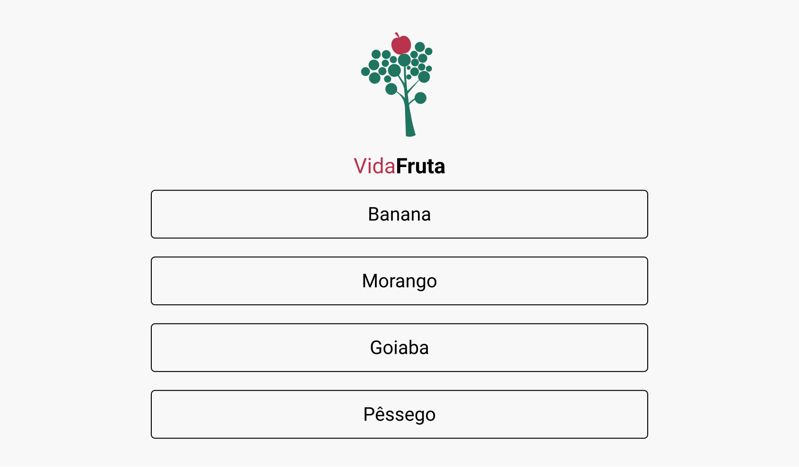

<h1>Atividade - Lista de frutas</h1>

<h3>Introdução</h3>
Nesta atividade você irá exercitar partes dos conceitos adquiridos até agora sobre HTML, CSS e DOM.

<h3>Contextualizando</h3>
Uma hortifruti te contratou para criar uma página web. O designer já te enviou o modelo e agora basta implementar. Segue o Layout do designer: 
 

<h3>Primeiros Passos</h3>
A imagem pode ficar ao seu critério, o dono ainda não tem uma logo. Não se esqueça de preparar seu repositório no github e seguir os seguintes passos:.

- Crie a pasta do projeto.
- Dentro do projeto crie uma pasta assets.
- Dentro da pasta assets crie uma pasta img onde irá guardar a imagem.
- Na raiz do projeto crie os arquivos index.html, style.css e script.js
- Conecte o script.js e style.css ao index.html
 
 

<b>Taken from Kenzie Academy Brasil</b>

