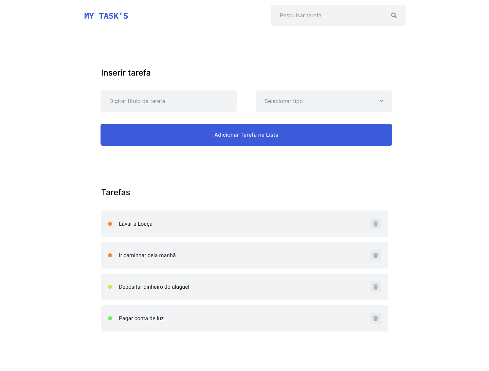

<h1>Atividade - Lista de Tarefas</h1>

As tarefas domésticas estão cada dia mais difíceis de serem organizadas. Você então decidiu fazer uma aplicação para ter mais controle.

Desenvolva uma aplicação que mostre um array de objetos na tela.

Para organizar a ideia você decidiu criar um layout. Você já pensa no crescimento da aplicação e decidiu criar algo mais completo, para funcionalidades futuras. 

<h4>Links!</h4>
Esta atividade ela é usada como referência em outros momentos da semana. Todos os botões usados no layout proposto serão implementados. Por hora, faça só o que pede a atividade.

<h3>Pensando na execução</h3>
Você deverá criar um array de tarefas.

Uma tarefa possui título e tipo.

Título basicamente é o que deve ser feito, e tipo é definido como: urgente, prioritário ou normal.

Atenção às tarefas urgentes, sempre serão renderizadas no topo da lista.

Seguindo a ordem de maior importância para menor.
Sua aplicação deverá ter a funcionalidade de renderizar somente o título, o tipo será utilizado para organizar os elementos da lista.
Por padrão a lista que é exibida é a lista com todas as tarefas organizadas por mais urgente para menos urgente

<h4>Links!</h4>
O layout acima, é apenas uma sugestão. Não precisa se preocupar em fazer igual. O importante desta atividade é fazer com que você consiga compreender a comunicação das funcionalidades do Js: DOM em conjunto com o Html e Css

Você desenvolveu sua lista de tarefas e as coisas começaram a fazer mais sentido e ficar bem mais organizadas.

Seu amigo gostaria de ter uma aplicação semelhante a que desenvolveu anteriormente, mas ele não tem conhecimento em JavaScript para adicionar as tarefas de maneira manual.

Para ajudá-lo, faça algumas modificações na lista de tarefas, adicione dois campos: um para o título, e outro para o tipo e um botão para inserir a tarefa na lista de tarefas.

<h3>Pensando na solução</h3>
Crie um input do tipo texto  
Crie um select com as opções(urgente, prioritário e normal).

Caso não lembre volte na aula de Formulário Select  
Crie uma função que vai receber como parâmetro as informações passadas  
Use as informações recebidas como parâmetro para criar um objeto e inserir na lista de tarefas  
Atualize a lista

Sua aplicação de lista de tarefas está realmente dando o que falar.

Um novo desafio surgiu, como a lista de tarefas de seu amigo está realmente ficando com muitos itens, ele acha que seria muito bom se ele conseguisse fazer uma busca pelo título.

Para isso você vai precisar de um novo campo de texto.

Este campo de texto será o responsável por armazenar o valor digitado para a busca, crie um botão de busca para quando o usuário terminar de digitar.

<h3>Pensando na solução</h3>
Crie uma função que recebe a palavra digitada como parâmetro  
Normalize o texto digitado(UpeperCase ou LowerCase)  
Percorra sua lista de objetos fazendo a comparação  
O resultado desta comparação pode resultar em um ou mais elementos, então você deverá criar um novo array com o resultado da busca.  
Envie o resultado da busca para sua função de renderização

<h4>Links!</h4>
O layout acima, é apenas uma sugestão. Não precisa se preocupar em fazer igual. O importante desta atividade é fazer com que você consiga compreender a comunicação das funcionalidades do Js: DOM em conjunto com o Html e Css

<h3>Desafio</h3>
Implemente uma função que seja capaz de remover um item da lista.  
Você poderá usar um botão que carregará no JS essa função de deleção, após remover o elemento da lista.

chame sua função de renderização.

<h4>Importante!</h4>
Cuidado para não duplicar a lista, limpe o local onde está renderizando a lista e atualize a lista com o novo elemento já adicionado. É interessante ter uma função para ficar responsável somente por renderizar os elementos em tela, desta forma. Pode usar o innerHtml = '' e em seguida chamar sua função de renderização.
 
 

<b>Taken from Kenzie Academy Brasil</b>

