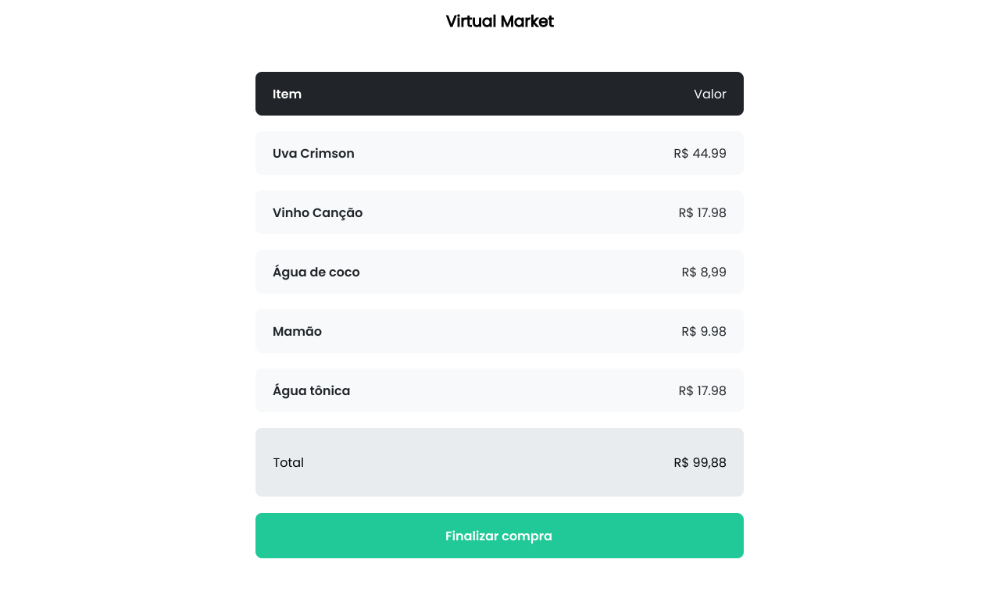
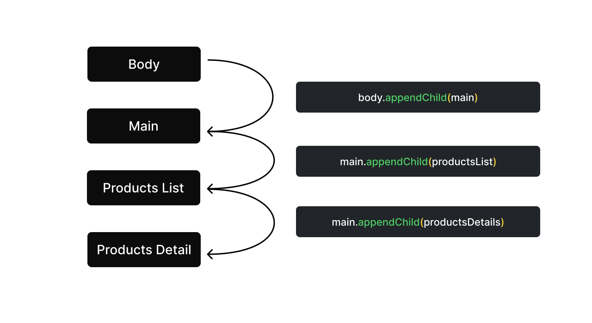

Entrega: Carrinho de Compras

Introdução
Você possui uma lista de produtos e deseja treinar seus conhecimentos em DOM para criar uma página dinâmica com a seção de produtos e carrinho de compras. Para tornar seu conhecimento mais desafiador, decidiu que nada do resultado final poderá vir do HTML puro.

Para ter uma ideia base, você decidiu olhar alguns sites de mercados da sua região e encontrou um layout simples que poderá reproduzir.

Layout

Aviso
O layout acima é meramente ilustrativo. O objetivo desta entrega é desenvolver uma página dinâmica com o DOM e lógica, portanto sinta-se livre para estilizar da sua maneira.

Pensando na solução
Crie dinamicamente uma tag main dentro de body;
Crie um array de objetos products, onde os objetos possuem nome e preço;
Dentro da tag main você deverá inserir uma lista não ordenada para o array products;
Crie uma variável soma, ela irá representar a soma total dos itens no carrinho;
Crie um botão contendo a string "Finalizar";
Crie uma section para receber a soma e o botão;
Dentro da tag main, após a lista não ordenada de products, você deverá inserir a section com a soma dos produtos e o botão "Finalizar";
Todas as tags deverão ser criadas dinamicamente utilizando o DOM.

Como sua estrutura DOM deverá ser:

